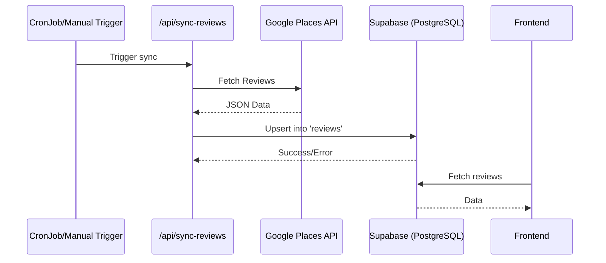

# Design: Automatización de Google Reviews

## Arquitectura de Datos
La arquitectura transiciona de un archivo JSON estático a una base de datos PostgreSQL en Supabase.

### Estructura de la Base de Datos (Supabase)
Se utilizará una tabla `reviews` para almacenar las reseñas.

```sql
CREATE TABLE IF NOT EXISTS public.reviews (
  id TEXT PRIMARY KEY,
  author_name TEXT NOT NULL,
  rating INTEGER NOT NULL,
  text TEXT,
  time TEXT,
  author_url TEXT,
  profile_photo_url TEXT,
  created_at TIMESTAMP WITH TIME ZONE DEFAULT timezone('utc'::text, now())
);

ALTER TABLE public.reviews ENABLE ROW LEVEL SECURITY;

CREATE POLICY "Allow public read access" ON public.reviews
  FOR SELECT USING (true);
```

## Flujo de Datos



## Implementación Frontend
El componente `pipodGoogleReviews.tsx` consumirá los datos a través de una función de servicio en `src/lib/supabase/reviews.ts`.

### Servicio `src/lib/supabase/reviews.ts`
```typescript
import { supabase } from './client';

export async function getReviews() {
  const { data, error } = await supabase
    .from('reviews')
    .select('*')
    .order('time', { ascending: false });

  if (error) throw error;
  return data;
}
```

## Consideraciones
- **RLS:** La política `Allow public read access` garantiza que el frontend pueda leer las reseñas sin restricciones.
- **Upsert:** La API de sincronización debe implementar una lógica de *upsert* basada en el ID de la reseña de Google para evitar duplicados.
