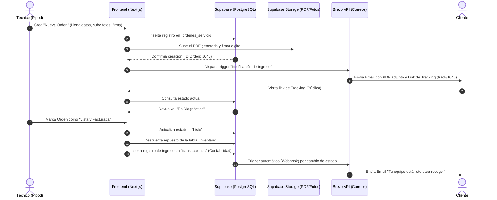

Para visualizar cómo se organiza todo el código de este sistema en tu editor y cómo se comunican las piezas entre sí, te lo desgloso en dos partes: la estructura exacta de carpetas para **Next.js 14 (App Router)** y un diagrama de flujo en Markdown (usando Mermaid) que explica la integración paso a paso.

### 1. Estructura de Carpetas (Estilo VS Code)

Esta es la arquitectura de carpetas que deberías inicializar. Separa claramente la parte pública (el tracking), la parte privada (el dashboard) y la lógica de backend (API, Supabase, Brevo).

```text
pipod-nextgen/
├── src/
│   ├── app/                        # Rutas de Next.js (App Router)
│   │   ├── (dashboard)/            # Grupo de rutas privadas (requieren login)
│   │   │   ├── layout.tsx          # Menú lateral (Sidebar) y barra superior
│   │   │   ├── page.tsx            # Inicio (Métricas rápidas)
│   │   │   ├── clientes/
│   │   │   │   └── page.tsx        # Buscador global y tabla de 2,300 clientes
│   │   │   ├── ordenes/
│   │   │   │   ├── nueva/page.tsx  # Formulario de recepción y firma
│   │   │   │   └── [id]/page.tsx   # Vista detallada de una orden
│   │   │   ├── inventario/
│   │   │   │   └── page.tsx        # Stock de repuestos
│   │   │   └── finanzas/
│   │   │       └── page.tsx        # Ingresos, egresos y contabilidad
│   │   │
│   │   ├── api/                    # Backend Serverless
│   │   │   ├── brevo/route.ts      # API para disparar correos transaccionales
│   │   │   └── pdf/route.ts        # Generador de PDFs en el servidor
│   │   │
│   │   ├── track/                  # Portal público para clientes
│   │   │   └── [id]/page.tsx       # Vista sin login para ver el estado del equipo
│   │   │
│   │   ├── login/                  # Pantalla de autenticación para técnicos
│   │   │   └── page.tsx
│   │   └── layout.tsx              # Root layout
│   │
│   ├── components/                 # Componentes reutilizables de React
│   │   ├── ui/                     # Componentes de shadcn/ui (botones, inputs, modales)
│   │   ├── forms/                  # Formularios complejos (ej. ClienteForm)
│   │   ├── layout/                 # Sidebar, Navbar
│   │   └── pdf/                    # Plantillas de React-PDF (@react-pdf/renderer)
│   │
│   ├── lib/                        # Lógica de negocio e integraciones
│   │   ├── supabase/
│   │   │   ├── client.ts           # Cliente de Supabase para el frontend
│   │   │   └── server.ts           # Cliente de Supabase para rutas seguras/API
│   │   ├── brevo.ts                # Funciones para hablar con la API de Brevo
│   │   └── utils.ts                # Funciones de ayuda (formatear moneda, fechas)
│   │
│   └── types/                      # Definiciones de TypeScript
│       └── database.types.ts       # Tipos exportados de PostgreSQL
│
├── public/                         # Logos de Pipod, fuentes, iconos estáticos
├── middleware.ts                   # Protege las rutas (redirecciona si no hay sesión)
├── tailwind.config.ts
└── package.json
```

---

### 2. Diagrama de Integración y Flujo de Datos

Para que tú y el cliente puedan visualizar "qué pasa cuando se hace una factura o se recibe un equipo", puedes usar un diagrama **Mermaid**. La mayoría de los visores de Markdown (como GitHub, Notion o extensiones de VS Code) renderizan este código automáticamente como un gráfico visual.

Aquí tienes el código `.md` con el flujo completo de una orden, desde que entra hasta que impacta la contabilidad:



### Explicación del Flujo Integrado (El "Y así...")

Si observas el diagrama y la arquitectura, la magia de la integración ocurre de manera secuencial:

1. **La Entrada:** Cuando haces la recepción del equipo en la ruta `app/(dashboard)/ordenes/nueva/page.tsx`, envías la información a tu base de datos en Supabase (`lib/supabase/client.ts`).
2. **El Archivo:** Inmediatamente, la librería `@react-pdf/renderer` construye el recibo. Ese PDF se sube a Supabase Storage y se guarda la URL en la orden.
3. **El Correo Inicial:** Next.js llama a `lib/brevo.ts` y le dice: *"Manda la plantilla de ingreso a este cliente y adjunta el link del PDF"*.
4. **La Consulta Pública:** El cliente abre su correo, hace clic en el enlace y entra a `app/track/[id]/page.tsx`. Esta ruta lee de Supabase pero **solo tiene permisos de lectura** (RLS), garantizando que el cliente vea el progreso pero no pueda alterar nada.
5. **La Facturación/Contabilidad:** Cuando el técnico marca la orden como "Entregada", ocurren tres cosas exactas en la base de datos (con una transacción SQL para que no haya errores):
   * Se cambia el estado de la orden.
   * Se resta un ítem (ej. "Pantalla iPhone 13") de la tabla `inventario`.
   * Se suma el valor total del servicio a la tabla `transacciones`, impactando el panel de la ruta `app/(dashboard)/finanzas/page.tsx`.
6. **El Cierre:** Supabase detecta el cambio a "Entregado" y le avisa automáticamente a Brevo para que dispare el correo final de retiro.

Si copias y pegas ese bloque de `mermaid` en un archivo `.md` en VS Code (teniendo instalada la extensión Markdown Preview Mermaid Support) o en un bloque de código de Notion, verás el gráfico generado instantáneamente.